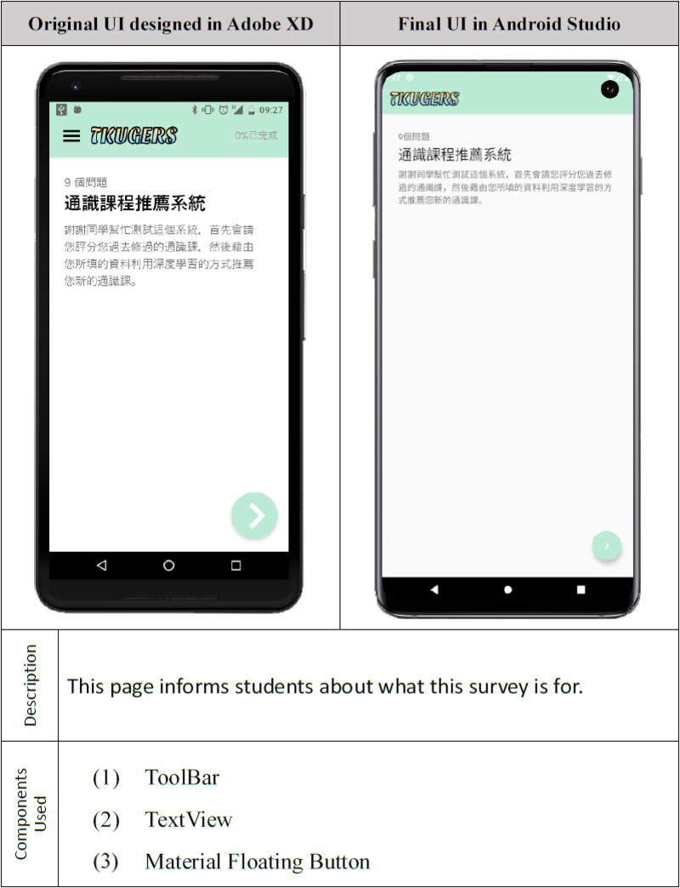
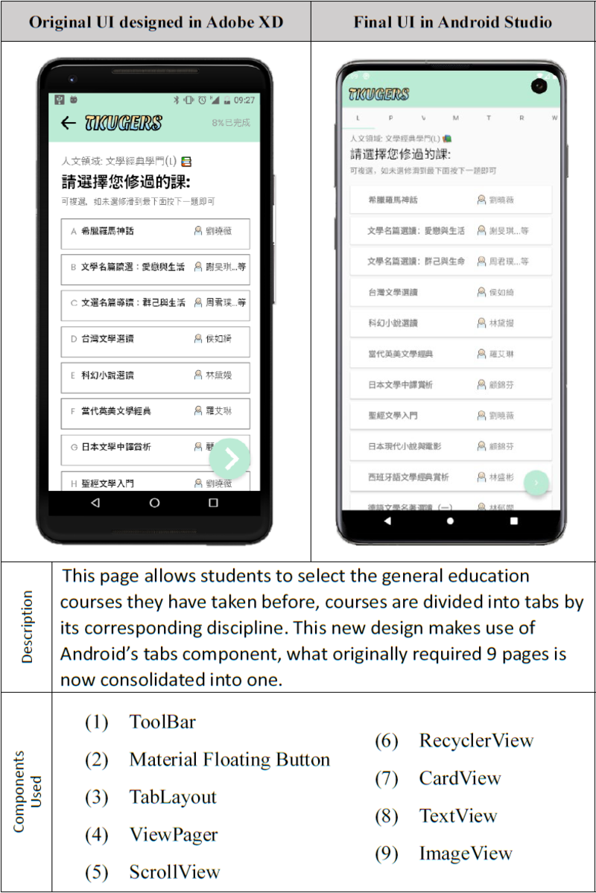
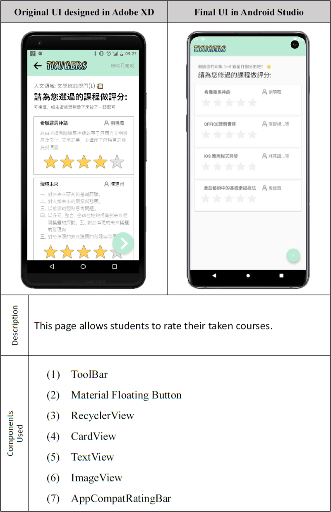
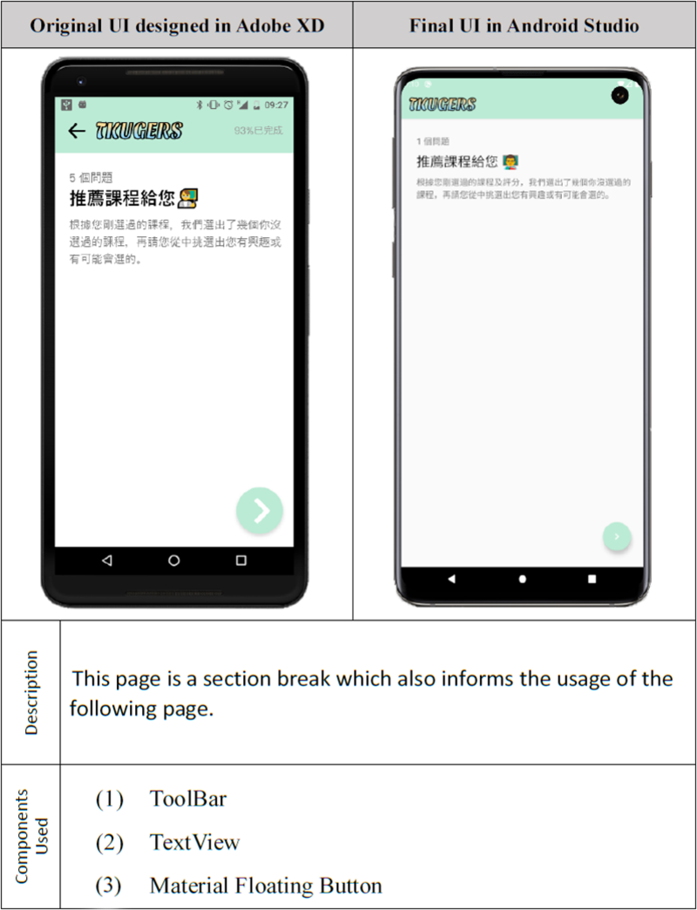
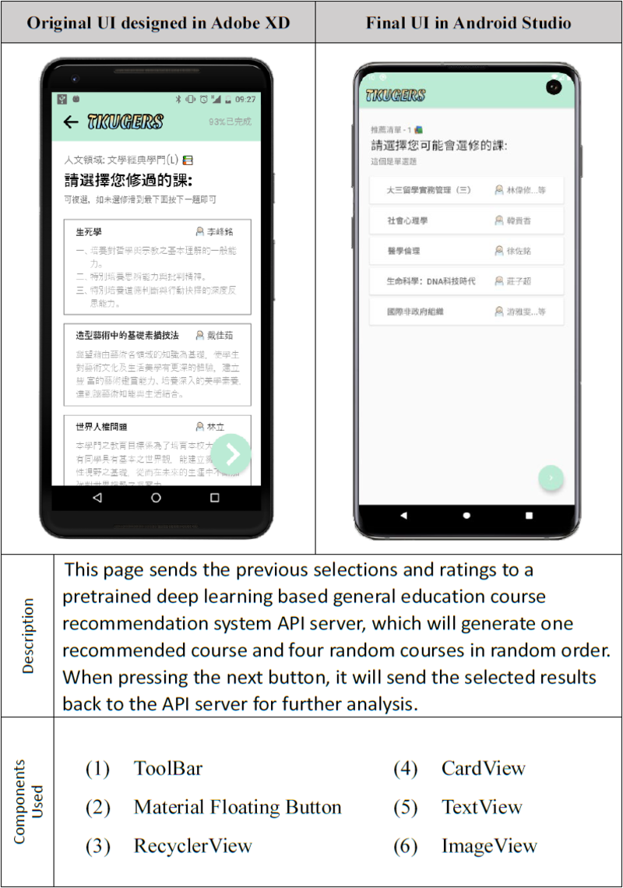
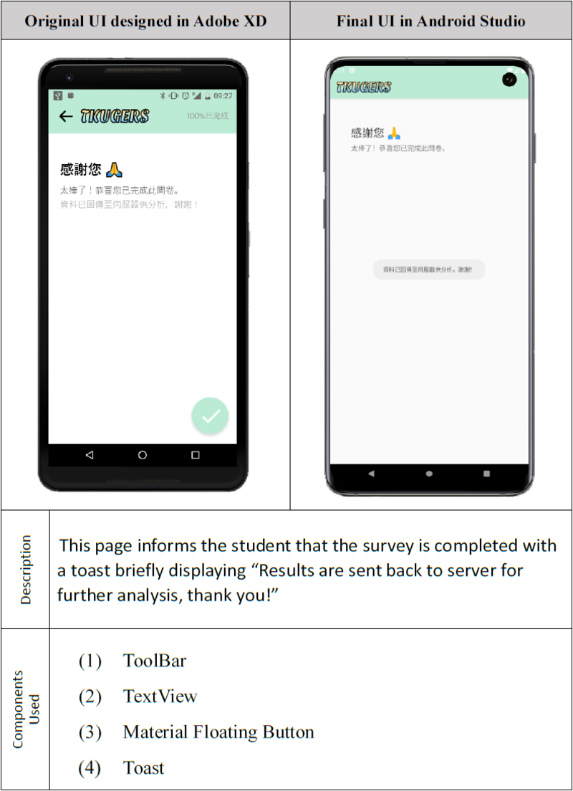

  <a href="README.md">
  [中文]
  </a>

<h1 align="center">
   
  
   
</h1>

<h4 align="center">A deep learning recommendation system based general education course survey.</h4>

  <a href="#origin">Origin</a> •
  <a href="#features">Features</a> •
  <a href="#project-info">Project Info</a> •
  <a href="#pages">Pages</a> •
  <a href="#q&a">Q&A</a>

## Origin
This android app is the final project of <a href="http://ap09.emis.tku.edu.tw/109_1/109_1_6085.PDF" target="_blank"><i>MOBILE PHONE PROGRAMMING</i></a> course given by Prof.Wu at Tamkang University. We were given the task to make a survey app, which at the time our website was already online. We thought to ourselves why not make a android version of our surveying website, and so this was how this app was created.

## Features
- 100% Kotlin
- Make use of Kotlin's new features including: <u>KTX library</u> and <u>Coroutines</u>
- Used 33 Jetpack libraries such as: <u>Navigation</u>, <u>ViewModel</u>, <u>Material Components</u>...etc.
- Organize courses into tabs for a cleaner UI
- Able to send requests to our general education course recommendation system api server<a href="https://github.com/TKUGERS/android-app/releases/tag/v1.0" target="_blank">*</a>, and refresh options based on the recieved reponse

## Project Info
- Target SDK Version: 30 (Android 11.0(R))
- Min SDK Version: 21
- Build Tools Version: 30.0.2
- Android Gradle Plugin Version: 3.6.4
- Gradle Version: 6.5
- Kotlin Version: 1.4.21
- 

Dependencies
<ul><li>appcompat: 1.0.0</li><li>constraintlayout: 1.1.3</li><li>converter-moshi: 2.9.0</li><li>espresso-core: 2.9.0</li><li>junit: 1.1.1</li><li>kotlin-stdlib: 1.4.21</li><li>legacy-support-v4: 1.0.0</li><li>material: 1.0.0</li><li>moshi-kotlin-codegen: 1.11.0</li><li>moshi-kotlin: 1.11.0</li><li>navigation-fragment-ktx: 2.3.2</li><li>navigation-ui-ktx: 2.3.2</li><li>okhttp: 3.12.1</li><li>recyclerview-selection: 1.0.0</li><li>retrofit: 2.9.0</li></ul>

## Pages
1. First Page 
  
2. Second Page 
  
3. Third Page 
  
4. Fourth Page 
  
5. Fifth Page 
  
6. Sixth Page 
  

## Q&A
I've done lots of research and gone through lots of websites, so I thought I'd posted some here just for your convenience
1. Why single Activity, multi Fragment architecture？
    > * [Migrate to the Navigation component](https://developer.android.com/guide/navigation/navigation-migrate)
    > * [Single activity: Why, when, and how (Android Dev Summit '18)](https://youtu.be/2k8x8V77CrU)
    > * [Reasons to use Android Single-Activity Architecture with Navigation Component](https://oozou.com/blog/reasons-to-use-android-single-activity-architecture-with-navigation-component-36)
    > Google keyword "single activity multiple fragments" for more, main reason being this architecture is what Google proposes.
2. Why use Retrofit？
    > * [Comparing Retrofit 2.0 vs. Volley](https://vickychijwani.me/retrofit-vs-volley/)
    > * [Is Retrofit faster than Volley? The answer may surprise you!](https://medium.com/@ali.muzaffar/is-retrofit-faster-than-volley-the-answer-may-surprise-you-4379bc589d7c)
3. Why use Moshi？
    > * [Why use Moshi over Gson?](https://www.reddit.com/r/androiddev/comments/684flw/why_use_moshi_over_gson/)
    > * [Goodbye Gson👋, Hello Moshi🤗](https://proandroiddev.com/goodbye-gson-hello-moshi-4e591116231e)
    > * [FYI, there is a pattern I really like when using moshi with Kotlin](https://medium.com/@jm_fayard/fyi-there-is-a-pattern-i-really-like-when-using-moshi-with-kotlin-e7fd45375a3e)