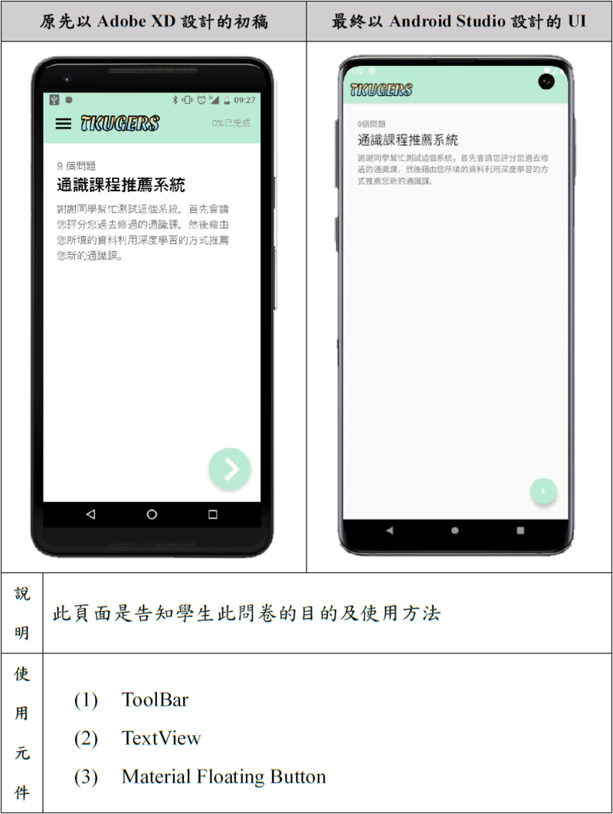
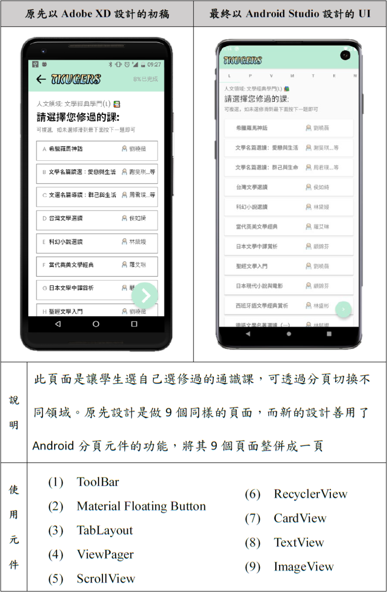
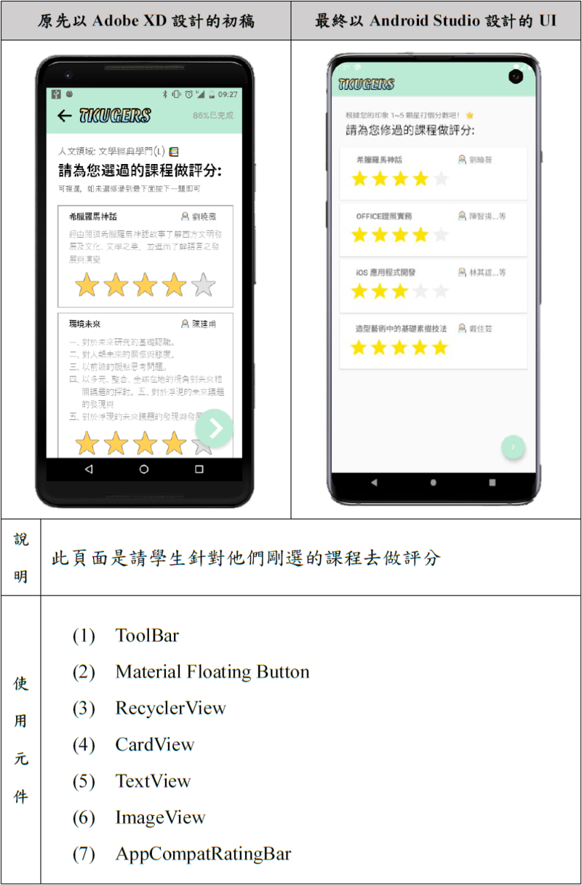
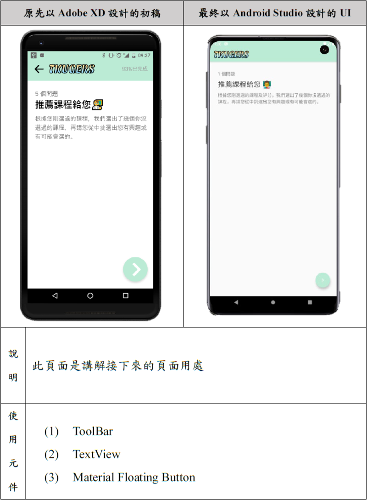
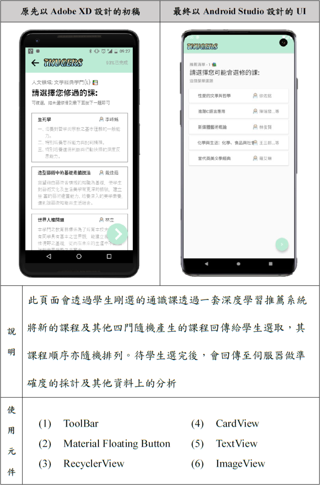
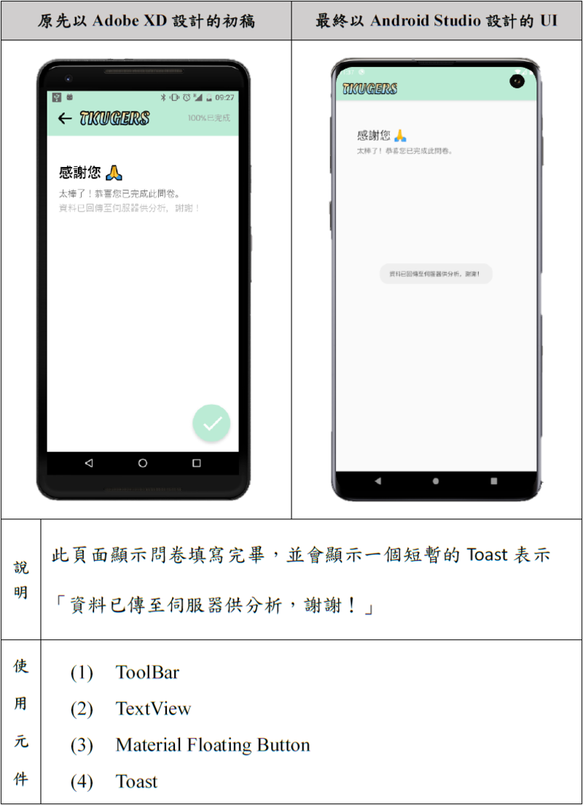

  <a href="README-EN.md">
  [English]
  </a>

<h1 align="center">
   
  
   
</h1>

<h4 align="center">一個結合<i>深度學習推薦系統</i> 的通識課程問卷</h4>

  <a href="#起源">起源</a> •
  <a href="#功能">特點</a> •
  <a href="#基本資訊">基本資訊</a> •
  <a href="#頁面介紹">頁面介紹</a> •
  <a href="#q&a">Q&A</a>

## 起源
這個 Android 應用程式是<a href="http://ap09.emis.tku.edu.tw/109_1/109_1_6085.PDF" target="_blank"><b>手機程式設計</b></a>課程的期末作品，此課程由吳柏翰老師在淡江電機系開設。我這組抽到的題目是做一個問卷的應用程式，當時我的<a href="https://tkugers.com/" target="_blank">網站</a>已上線，我就想：「何不將我們的網站做成應用程式？」這就是這個應用程式的起源。

## 特點
- 100% Kotlin
- 善用了 Kotlin 的新功能例如：<u>KTX 程式庫</u>和 <u>Coroutines</u>
- 使用了 33 個 Jetpack 程式庫，包括：<u>Navigation</u>、<u>ViewModel</u>、<u>Material 元件</u>等
- 透過分頁將通識課程分類，方便選取也較為整潔
- 可以向我們的課程推薦系統 API 伺服器發送使用者選取的課程<a href="https://github.com/TKUGERS/android-app/releases/tag/v1.0" target="_blank">*</a>，並利用回傳的 response 更新頁面的選項

## 基本資訊
- Target SDK Version: 30 (Android 11.0(R))
- Min SDK Version: 21
- Build Tools Version: 30.0.2
- Android Gradle Plugin Version: 3.6.4
- Gradle Version: 6.5
- Kotlin Version: 1.4.21
- 

Dependencies
<ul><li>appcompat: 1.0.0</li><li>constraintlayout: 1.1.3</li><li>converter-moshi: 2.9.0</li><li>espresso-core: 2.9.0</li><li>junit: 1.1.1</li><li>kotlin-stdlib: 1.4.21</li><li>legacy-support-v4: 1.0.0</li><li>material: 1.0.0</li><li>moshi-kotlin-codegen: 1.11.0</li><li>moshi-kotlin: 1.11.0</li><li>navigation-fragment-ktx: 2.3.2</li><li>navigation-ui-ktx: 2.3.2</li><li>okhttp: 3.12.1</li><li>recyclerview-selection: 1.0.0</li><li>retrofit: 2.9.0</li></ul>

## 頁面介紹
1. 第一頁
  
2. 第二頁 
  
3. 第三頁 
  
4. 第四頁 
  
5. 第五頁 
  
6. 第六頁 
  

## Q&A
我當時參考了很多資料，以下的問題我這裡列出幾個我看過的網站
1. 為何選用單一 Activity、多 Fragment 架構？
    > * [Migrate to the Navigation component](https://developer.android.com/guide/navigation/navigation-migrate)
    > * [Single activity: Why, when, and how (Android Dev Summit '18)](https://youtu.be/2k8x8V77CrU)
    > * [Reasons to use Android Single-Activity Architecture with Navigation Component](https://oozou.com/blog/reasons-to-use-android-single-activity-architecture-with-navigation-component-36)
    > Google 搜尋 "single activity multiple fragments" 有更多，主要是這個架構也是 Google 提倡的作法。
2. 為何選用 Retrofit？
    > * [Comparing Retrofit 2.0 vs. Volley](https://vickychijwani.me/retrofit-vs-volley/)
    > * [Is Retrofit faster than Volley? The answer may surprise you!](https://medium.com/@ali.muzaffar/is-retrofit-faster-than-volley-the-answer-may-surprise-you-4379bc589d7c)
3. 為何選用 Moshi？
    > * [Why use Moshi over Gson?](https://www.reddit.com/r/androiddev/comments/684flw/why_use_moshi_over_gson/)
    > * [Goodbye Gson👋, Hello Moshi🤗](https://proandroiddev.com/goodbye-gson-hello-moshi-4e591116231e)
    > * [FYI, there is a pattern I really like when using moshi with Kotlin](https://medium.com/@jm_fayard/fyi-there-is-a-pattern-i-really-like-when-using-moshi-with-kotlin-e7fd45375a3e)